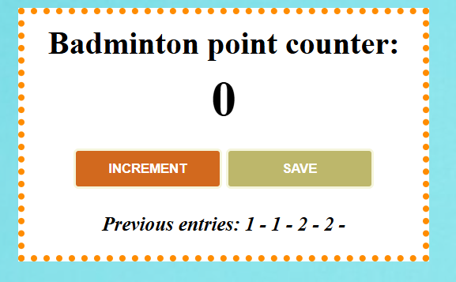

# Counter mini-app

The app will count objects using the 'increment function' and will save the counted data using 'save function'. When you will click on 'save button' the saved data will appear at 'Previous entries' and the counter will return to 0.

## Tehnologii folosite

- HTML
- CSS
- JavaScript

## Cum se folosește

1. Clonează repository-ul
2. Deschide index.html în browser

## Capturi de ecran

## Link live

Vezi aplicatia live aici: https://lively-basbousa-6a2d67.netlify.app/

